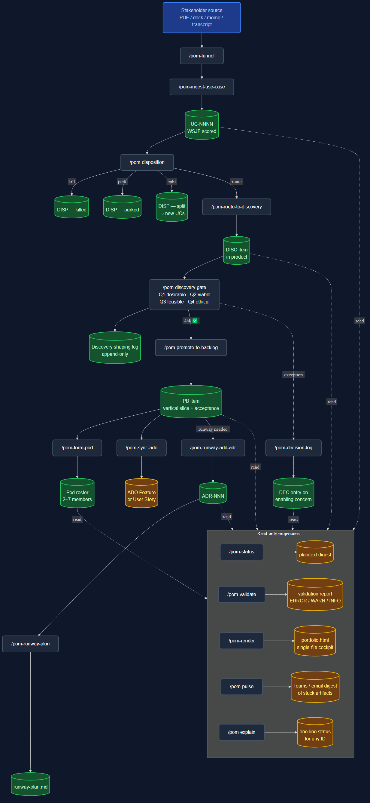

# Product Operating Model — Claude Code marketplace

## Who this is for

- **Heads of Product, CPOs, and product-ops leaders** standing up (or rescuing) a Marty-Cagan-style product operating model and tired of governance living in slide decks.
- **Product trios** (PM / PD / TL) who want decisions — kill, park, route, promote — captured in one auditable trail instead of scattered across Jira, Confluence, and Slack threads.
- **Portfolio and platform leaders** balancing many products, shared platform services, and enabling concerns (AI ethics, security, accessibility) without re-litigating standards on every initiative.
- **Regulated-industry teams** (insurance, fintech, healthcare, retail) who need industry-specific ethical and viability framing baked into the gate, not bolted on afterwards.
- **Solo founders and small product teams** who want the discipline of a real operating model without hiring a transformation consultancy to install one.

## Why use it

- **Operate the model, don't just diagram it.** Every step — intake, WSJF scoring, four-question gate, disposition, runway, pod formation — is a Claude Code command that writes real artifacts, not a Miro board you'll abandon in three weeks.
- **Auditable by default.** Append-only UCs, dispositions, ADRs, and decision logs mean you can always answer "why did we kill that?" or "who signed off on this exception?" months later.
- **Gates that actually gate.** `pom-promote-to-backlog` refuses to promote anything that isn't 4/4 ✅; `pom-form-pod` enforces the 2–7 composition rule; `pom-ingest-use-case` won't write a UC without WSJF scores. The methodology is enforced in code, not vibes.
- **Industry-calibrated out of the box.** Insurance, fintech, healthcare, and retail overlays ship calibrated WSJF rubrics and starter enabling standards — you're not writing the PHI-handling standard from scratch on day one.
- **Lives where work happens.** Pure markdown, no separate SaaS to license, no database to maintain, no integrations to break. Runs anywhere Claude Code runs and plays well with whatever tracker your team already uses (Azure DevOps, Jira, Linear, GitHub Issues).
- **Reversible adoption.** Start with one product, one Use Case, one disposition. There's no platform migration — the whole thing is files in a repo.

---

A Claude Code marketplace that operationalises the **Product Operating Model** (POM) — a target operating model for product organisations. It covers:

- **Intake** — capture stakeholder inputs as Use Cases, score them with WSJF
- **Discovery gating** — the four-question gate (desirable / viable / feasible / ethical)
- **Routing** — kill / park / route / split decisions, with disposition tracking
- **Products, pods, runway** — product team scaffolding with 2–7 pod composition rule, ADR-driven runway, runway plans
- **Platform layer** — portfolio-shared services with intake/consumption contracts
- **Enabling concerns** — AI ethics, security, accessibility, data quality (generic) plus industry overlays
- **Validation** — structural ruleset (~30 rules) that runs in seconds against any POM repo

Modelled on the Marty Cagan / Voyager / SVPG product operating model literature, packaged for daily use inside Claude Code.

## Quick install

```text
/plugin marketplace add swanson-dev/product-operating-model
/plugin install pom-core@product-operating-model
```

Optional industry overlays (install after `pom-core`):

```text
/plugin install pom-insurance@product-operating-model
/plugin install pom-fintech@product-operating-model
/plugin install pom-healthcare@product-operating-model
/plugin install pom-retail@product-operating-model
```

After install, scaffold a POM repo and start operating:

```text
/pom-bootstrap /path/to/new-portfolio --rubric=generic
/pom-funnel /path/to/new-portfolio/use-cases/first-memo.pdf
/pom-status /path/to/new-portfolio
```

## What's in the marketplace

| Plugin | Required? | Files | What it gives you |
|--------|-----------|-------|-------------------|
| [`pom-core`](./plugins/pom-core/) | **Yes** | 15 skills, 7 agents, 4 orchestrator commands, full methodology library, generic industry baseline | Operate a complete POM portfolio |
| [`pom-insurance`](./plugins/pom-insurance/) | Optional | Calibrated rubric + 4 starter enabling standards (regulatory reporting, actuarial review, policyholder communications, state filings) | Insurance-specific Q4 framing (I1–I7) |
| [`pom-fintech`](./plugins/pom-fintech/) | Optional | Calibrated rubric + 4 starter enabling standards (PCI, KYC/AML/BSA, consumer protection, model risk) | Fintech-specific Q4 framing (F1–F7) |
| [`pom-healthcare`](./plugins/pom-healthcare/) | Optional | Calibrated rubric + 4 starter enabling standards (PHI handling, clinical safety, interoperability, AI-ethics-healthcare) | Healthcare-specific Q4 framing (H1–H8) |
| [`pom-retail`](./plugins/pom-retail/) | Optional | Calibrated rubric + 4 starter enabling standards (PCI-retail, accessibility-regulatory, omnichannel data, fulfillment integrity) | Retail-specific Q4 framing (R1–R7) |

Industry plugins are **content overlays** — they extend (never replace) the generic baseline in `pom-core`. Apply them via `/pom-<industry>-init <pom-repo-path>` after bootstrap.

## How the pieces fit



The text-only version of the same flow:

```
Stakeholder source  ──▶  /pom-funnel  ──▶  /pom-ingest-use-case  ──▶  UC scored (WSJF)
                                                                            │
                                                                            ▼
                                                                /pom-disposition
                                                          (kill │ park │ route │ split)
                                                                            │
                                                                  route ────┘
                                                                            ▼
                                                   /pom-route-to-discovery  ──▶  DISC in product
                                                                            │
                                                                            ▼
                                                       /pom-discovery-gate
                                                  (Q1 desirable, Q2 viable,
                                                   Q3 feasible, Q4 ethical)
                                                                            │
                                                                  4/4 ✅────┘
                                                                            ▼
                                                       /pom-promote-to-backlog  ──▶  PB item (vertical slice)
                                                                            │
                                                                            ▼
                                                              (pod pull, build, ship)
```

Each `pom-*` skill has matching workflow documentation in `plugins/pom-core/methodology/workflows/` and writes append-only artifacts (UCs, dispositions, DISC shaping logs, ADRs, decision-logs) that form the auditable history of how decisions got made.

## Repo layout

```
.
├── .claude-plugin/marketplace.json    ← marketplace manifest (5 plugins)
├── README.md                          ← this file
├── LICENSE                            ← MIT
├── CHANGELOG.md
└── plugins/
    ├── pom-core/                      ← the core plugin
    ├── pom-insurance/                 ← industry add-on
    ├── pom-fintech/                   ← industry add-on
    ├── pom-healthcare/                ← industry add-on
    └── pom-retail/                    ← industry add-on
```

Each plugin is independently installable. Each has its own `.claude-plugin/plugin.json` and `README.md` documenting its surface.

## Design principles

- **Append-only history**: UC scoring → disposition → DISC shaping → ADRs → enabling-concern decisions all leave an immutable trail. Reversals create new artifacts that supersede; nothing is silently rewritten.
- **Read-only validators**: `pom-status` and `pom-validate` never touch the portfolio.
- **Gate enforcement**: `pom-promote-to-backlog` refuses to promote without 4/4 ✅; `pom-ingest-use-case` refuses to write a UC without WSJF scores; `pom-form-pod` enforces the 2–7 composition rule.
- **Industry overlays are additive content, not replacement code**: a healthcare portfolio still uses the generic ai-ethics standard, plus the healthcare AI-ethics overlay — both, never one-or-the-other.
- **Agents earn their keep**: workflow agents protect main context on heavy reads; audit agents preserve confirmation-bias independence; role agent (`pom-trio`) explicitly stays in lane.

## Compatibility

- **Claude Code** versions supporting plugins + marketplace install (current spec at time of writing).
- **OS-agnostic** — uses `${CLAUDE_PLUGIN_ROOT}` for plugin-relative references; no hard-coded paths.
- **Markdown only** — no compiled binaries, no scripts that require a specific runtime beyond the Bash, Read, Write tools that Claude Code provides.

## Development setup

This is the source repo. If you're contributing or working on the marketplace itself:

```bash
git clone https://github.com/swanson-dev/product-operating-model
cd product-operating-model

# Install locally for live testing
# (Claude Code session:)
/plugin marketplace add E:\Projects\product-operating-model
/plugin install pom-core@product-operating-model

# Run the tests (informal — test files are spec-style, see plugins/pom-core/tests/)
ls plugins/pom-core/tests/
```

## Versioning

This marketplace and all 5 plugins are at **v0.1.0**. Future versions will:
- Bump per-plugin where changes are scoped
- Bump the marketplace version when the plugin list itself changes
- Maintain backwards-compatibility for one minor version per plugin

## License

MIT — see [LICENSE](./LICENSE). The methodology references (four-question gate, WSJF, vertical slicing) draw on widely-published industry practice; this packaging is original.

## Contributing

See [CHANGELOG.md](./CHANGELOG.md) for what's shipped. Contributions welcome via PR. For substantial changes, open an issue first to discuss.
